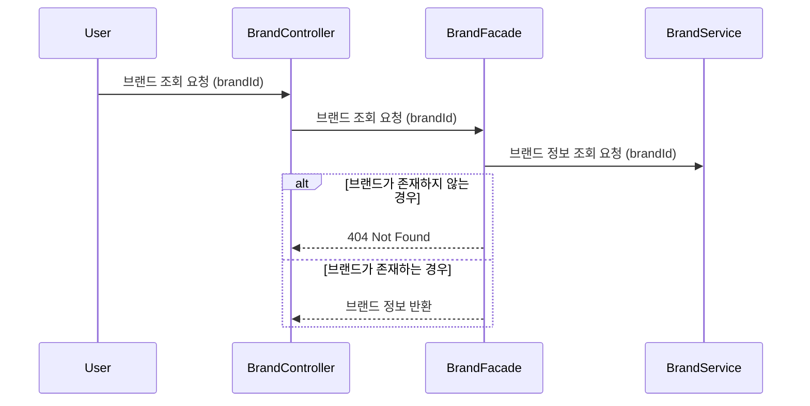
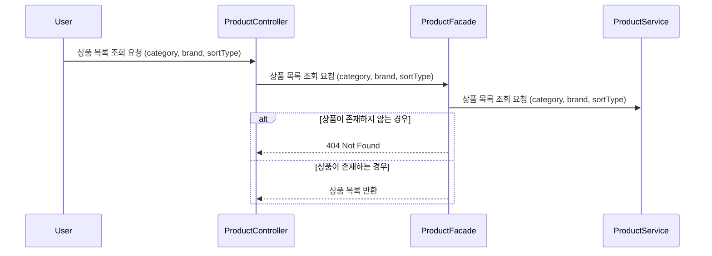
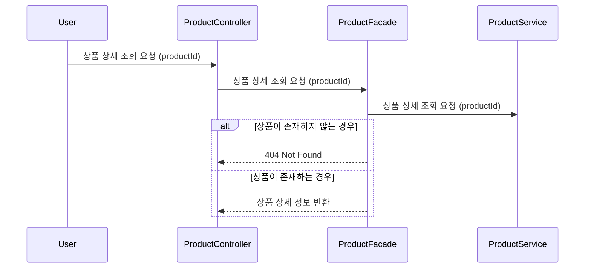
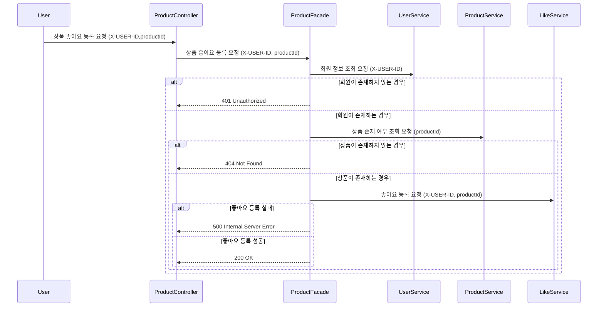
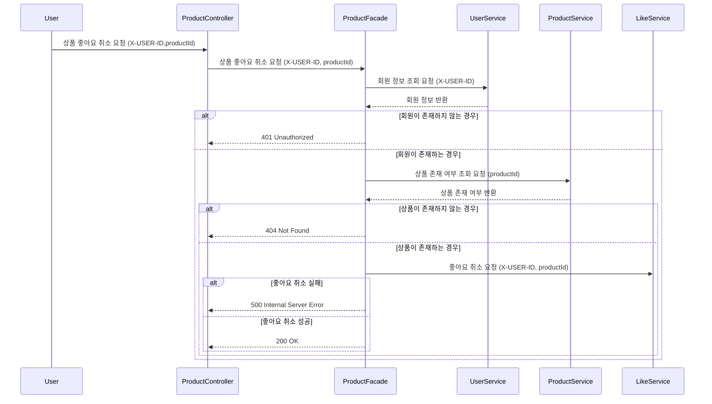
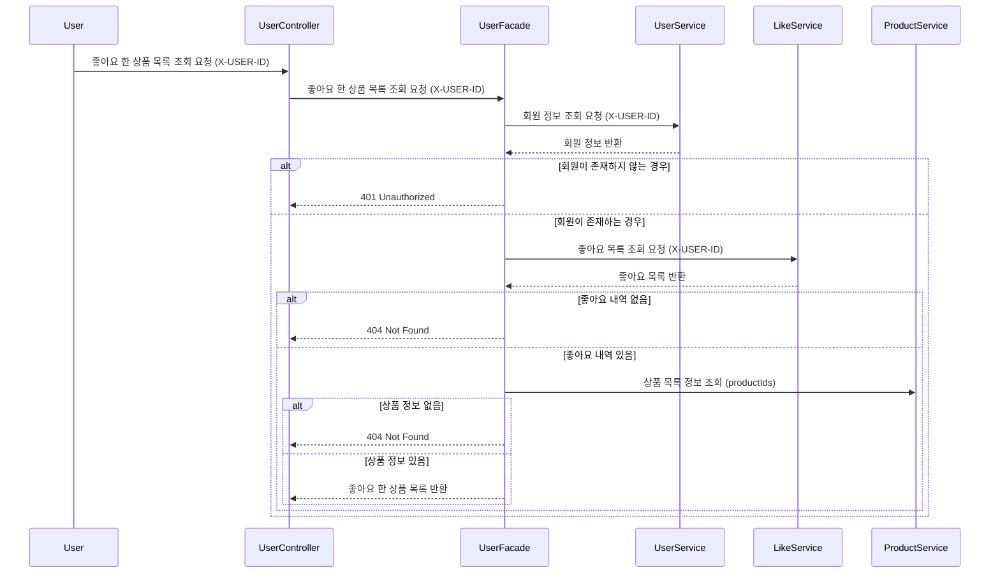
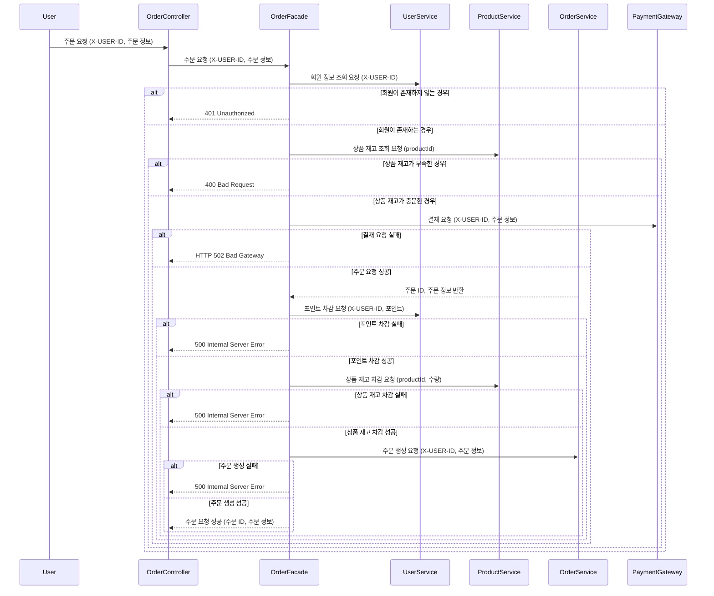
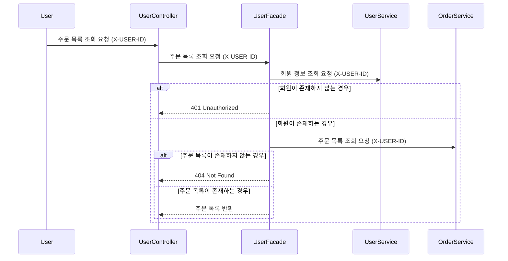
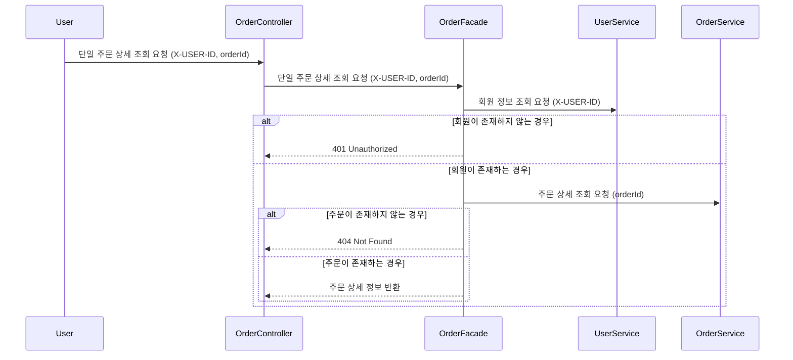

# 시퀀스 다이어그램

## 1. 브랜드 조회 (GET /api/v1/brands/{brandId})

## 2. 상품 목록 조회 (GET /api/v1/products)

## 3. 상품 상세 조회 (GET /api/v1/products/{productId})

## 4. 상품 좋아요 등록 (POST /api/v1/products/{productId}/likes)

## 5. 상품 좋아요 취소 (DELETE /api/v1/products/{productId}/likes)

## 6. 내가 좋아요 한 상품 목록 조회 (GET /api/v1/users/likes)

## 7. 주문 요청 (POST /api/v1/orders)

## 8. 유저의 주문 목록 조회 (GET api/v1/users/orders)

## 9. 단일 주문 상세 조회 (GET /api/v1/orders/{orderId})

