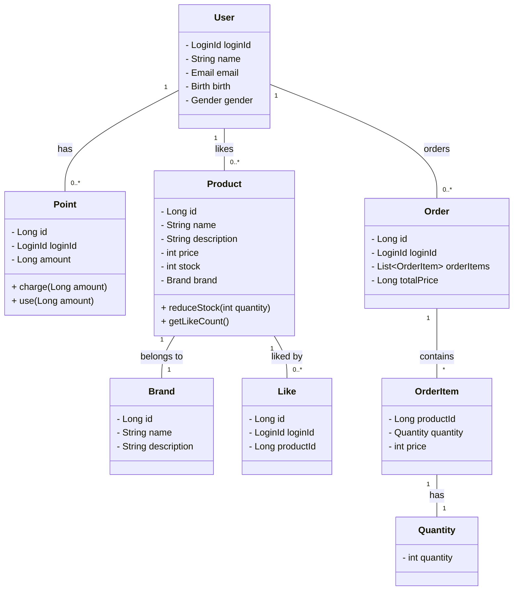

# 클래스 다이어그램

```mermaid
%% + : public
%% - : private
%% # : protected

classDiagram
    class User {
        - LoginId loginId
        - String name
        - Email email
        - Birth birth
        - Gender gender
    }

    class Point {
        - Long id
        - LoginId loginId
        - Long amount
        + charge(Long amount)
        + use(Long amount)
    }

    class Brand {
        - Long id
        - String name
        - String description
    }

    class Product {
        - Long id
        - String name
        - String description
        - int price
        - int stock
        - Brand brand
        + reduceStock(int quantity)
        + getLikeCount()
    }

    class Like {
        - Long id
        - LoginId loginId
        - Long productId
    }

    class Order {
        - Long id
        - LoginId loginId
        - List~OrderItem~ orderItems
        - Long totalPrice
    }

    class OrderItem {
        - Long productId
        - Quantity quantity
        - int price
    }

    class Quantity {
        - int quantity
    }

    User "1" -- "0..*" Point : has
    User "1" -- "0..*" Product : likes
    User "1" -- "0..*" Order : orders
    Product "1" -- "1" Brand : belongs to
    Product "1" -- "0..*" Like : liked by
    Order "1" -- "*" OrderItem : contains
    OrderItem "1" -- "1" Quantity : has
```