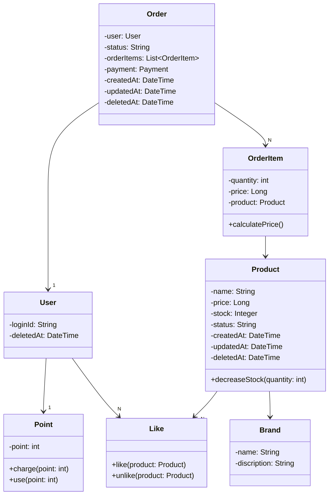

# 클래스 다이어그램

```mermaid
%% + : public
%% - : private
%% # : protected

classDiagram
    class User {
        -loginId: String
        -deletedAt: DateTime
    }

    class Point {
        -point: int
        +charge(point: int)
        +use(point: int)
    }

    class Like {
        +like(product: Product)
        +unlike(product: Product)
    }

    class Order {
        -user: User
        -status: String
        -orderItems: List~OrderItem~
        -payment: Payment
        -createdAt: DateTime
        -updatedAt: DateTime
        -deletedAt: DateTime
    }

    class OrderItem {
        -quantity: int
        -price: Long
        -product: Product
        +calculatePrice()
    }

%%    class Payment {
%%        -price: Long
%%        -status: String
%%    }

    class Product {
        -name: String
        -price: Long
        -stock: Integer
        -status: String
        -createdAt: DateTime
        -updatedAt: DateTime
        -deletedAt: DateTime
        +decreaseStock(quantity: int)
    }

%%    class Category {
%%        -type: String
%%        -name: String
%%        -depth: int
%%        +getCategoryInfo()
%%    }

    class Brand {
        -name: String
        -discription: String
    }

    User --> "1" Point
    User --> "N" Like
    Order --> "1" User
    Order --> "N" OrderItem
%%    Order --> Payment
    OrderItem --> Product
    Product --> "N" Like
%%    Product --> Category
    Product --> Brand
```